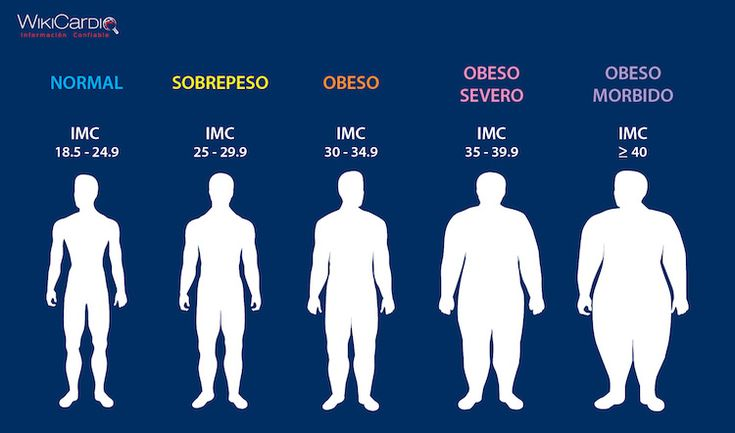

# Obesity Level Classification and Clustering Analysis

This project aims to classify and analyze obesity levels based on individuals' health and lifestyle habits using machine learning techniques. The project was developed as part of a course requirement for CS209, CS214 by [ankitkhushwaha](https://github.com/ankitkhushwaha), [nidhi-005](https://github.com/nidhi-005), [Ashwithamaisangari](https://github.com/Ashwithamaisangari) and Ayaan Karim.

